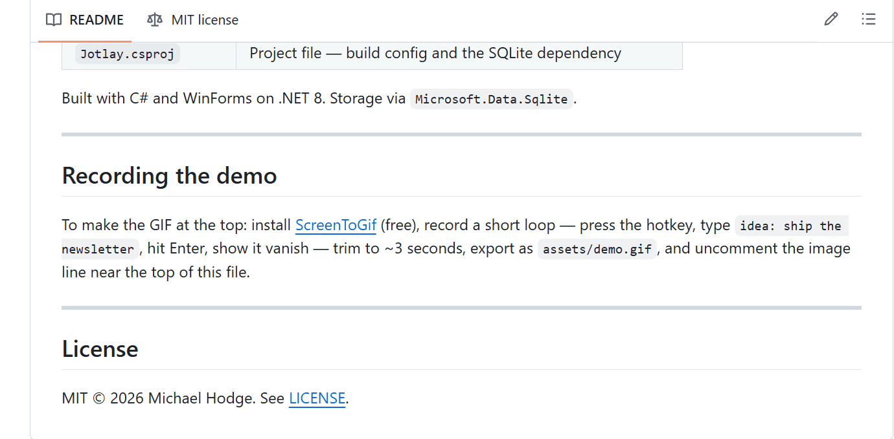

# Jotlay

**An always-on quick-capture overlay for Windows 11.** Press one hotkey from
anywhere — a browser, an editor, a terminal, anything — a small box appears, you
type a thought, hit Enter, and it's filed. No window to find, no app to switch
to, no losing your place. The name is *jot* + *overlay*: it's a layer that sits
over everything, waiting.



Default hotkey: **Ctrl+Alt+J** (changeable anytime from the tray).

---

## Why it exists

Ideas arrive at the worst times — mid-task, mid-sentence, while you're deep in
something else. The moment you stop to open a notes app, the thought's gone.
Jotlay removes that gap: the capture box is one keystroke away at all times, so
the thought goes down before it evaporates. Then it gets out of your way.

- **Instant.** Global hotkey summons it over any app. Type, Enter, done.
- **Organized without effort.** Type `idea:` or `todo:` and it files itself (see
  below). New categories are created the moment you use them.
- **Yours, and local.** Everything is stored in a plain SQLite file on your own
  machine. Jotlay makes **no network connections** — no accounts, no telemetry,
  no cloud. Your notes never leave your computer.
- **Light.** It sits in the tray using almost nothing until you press the key.

---

## Install

There's nothing to install — it's a single self-contained file.

1. Download `Jotlay.exe` from the [**Releases**](../../releases) page.
2. Put it wherever you like (Desktop, a folder, anywhere) and **double-click it**.
3. Look for the cyan **J** in your system tray (click the **^** by the clock if
   it's hidden).

That's it — it's running. Right-click the tray icon to turn on **Start with
Windows** if you want it to launch on boot, and **Change hotkey** if you want a
different combo than Ctrl+Alt+J.

> **First launch shows a blue "Windows protected your PC" box?** That's expected.
> Jotlay is open-source and not code-signed (signing certificates cost a few
> hundred dollars a year — not worth it for a free tool). Click **More info →
> Run anyway**. You can read every line of what it does right here in the source.

Everything stays on your machine. Your notes live at `%AppData%\Jotlay\jotlay.db`
— created automatically on first run, completely local, no accounts, no cloud, no
tracking.

### Building from source

If you'd rather build it yourself, you need the free
[.NET 8 SDK](https://dotnet.microsoft.com/download/dotnet/8.0). From the project
folder:

```
dotnet publish -c Release -r win-x64 --self-contained true -p:PublishSingleFile=true -p:IncludeNativeLibrariesForSelfExtract=true -p:EnableWindowsTargeting=true
```

The compiled `Jotlay.exe` lands in `bin\Release\net8.0-windows\win-x64\publish\`.
Double-click it and you're running.

---

## Use it

1. Press **Ctrl+Alt+J** from anywhere.
2. Type your note.
3. **Enter** saves and closes · **Shift+Enter** adds a line · **Esc** cancels ·
   clicking away also dismisses.

### The prefix system

Whatever you type before the first colon becomes the note's **bucket**. You never
set buckets up in advance — a new one is born the first time you use it.

```
work:  email the vendor about the invoice   ->  bucket "work"
idea:  a landing page that writes itself      ->  bucket "idea"
todo:  renew the domain before Friday         ->  bucket "todo"
call:  dentist, reschedule                     ->  bucket "call"
read:  that article on rust ownership          ->  bucket "read"
buy:   more coffee filters                      ->  bucket "buy"
a loose thought with no prefix                  ->  bucket "inbox"
```

The arrow at the bottom of the box (`→ work`) shows the target bucket live as you
type, so you see where it's going before you commit.

### Browsing, exporting, and deleting notes

Right-click the tray icon → **Browse notes**. This opens a window listing every
note individually, with a bucket filter and a search box to narrow the list. Tick
the notes you want and:

- **Export** writes the selected notes to Markdown — one `.md` file per bucket
  (`work.md`, `idea.md`, …), each with timestamps.
- **Delete** permanently removes the selected notes (with a confirmation, since
  it can't be undone).

Notes live in a SQLite database at `%AppData%\Jotlay\jotlay.db`, separate from the
exe — so moving or rebuilding the app never touches your notes.

### Changing the hotkey

Right-click the tray icon → **Change hotkey**, click the box, press the combo,
Save. If the combo is already taken by something else, you get a warning and your
existing hotkey keeps working. Common editing shortcuts (`Ctrl+C`, `Ctrl+V`,
`Ctrl+Z`, and similar) are refused, so Jotlay can't hijack copy/paste globally —
add a second modifier like `Ctrl+Alt+C` if you want one of those keys. Two
modifiers off the crowded Ctrl / Ctrl+Shift zone (like `Ctrl+Alt+J`) collide
least; avoid `Win+` combos, which Windows reserves.

---

## Uninstall

1. If you enabled **Start with Windows**, turn it off from the tray first (so no
   leftover startup entry remains).
2. Exit Jotlay from the tray (right-click → Exit).
3. Delete `Jotlay.exe`.
4. Your notes stay in `%AppData%\Jotlay` unless you delete that folder too.

No installer means no install folder, no registry mess, and nothing left behind
but the notes folder — which is yours to keep or delete.

---

## Build on top of it — please do

Jotlay is MIT-licensed: **fork it, modify it, ship your own version, do whatever
you want** — the only ask is to keep the copyright notice. Pull requests welcome,
forks even more so. This is meant to be a foundation, not a finished monument.

**The one thing worth knowing if you want to extend it:** the storage and routing
logic (`Database.cs` + `Router.cs`) is deliberately kept separate from the Windows
UI. That's where you plug in. The note engine doesn't know or care that it's
being driven by a WinForms popup.

Ideas that would be natural to build:

- **Tag colors** or per-bucket icons in the notes window.
- **Sync** — point the SQLite file at a synced folder, or add a proper backend.
- **An Android or web front-end** that reuses the `Database`/`Router` core, so the
  same buckets are live on your phone.
- **Smarter routing** — dates (`todo tomorrow:`), priorities, or auto-tagging.

If you build something, open an issue or PR — I'd love to see it.

---

## Advanced

**Setting the hotkey from the command line.** Normal users never need this — the
tray Settings dialog is the intended way. But if you're scripting a setup, the exe
accepts:

```
Jotlay.exe --set-hotkey ctrl+alt+j
```

It validates the combo and stores it (invalid input is rejected and leaves your
existing hotkey untouched), then exits without launching. It's purely a
convenience for scripting — the normal way is the tray Settings dialog.

**A note on the prefix rule.** The bucket is simply the text before the first
colon, if that text is a single clean word. This is deliberately simple, which
means a few inputs route in ways you might not expect — e.g. pasting
`http://example.com` files under a bucket called `http`, and `C:\path\file` files
under `c`. That's a fair trade for a dead-simple rule; just start such notes with a
space or a real prefix (`link: http://…`) if you want them elsewhere.

---

## Project layout

| File | What it does |
|------|--------------|
| `Program.cs` | Entry point, single-instance guard, `--set-hotkey` CLI |
| `TrayAppContext.cs` | Tray icon, menu, hotkey wiring, autostart |
| `HotkeyManager.cs` | Registers the global hotkey with Windows |
| `Hotkey.cs` | Shared hotkey parsing + validation (used by settings and CLI) |
| `CaptureForm.cs` | The popup input box |
| `SettingsForm.cs` | Hotkey-change dialog |
| `NotesWindow.cs` | Browse, search, export, and delete individual notes |
| `Database.cs` | SQLite storage (notes + settings) |
| `Router.cs` | Parses `bucket: body` prefix routing |
| `Jotlay.csproj` | Project file — build config and the SQLite dependency |

Built with C# and WinForms on .NET 8. Storage via `Microsoft.Data.Sqlite`.

---

## License

MIT © 2026 Michael Hodge. See [LICENSE](LICENSE).
